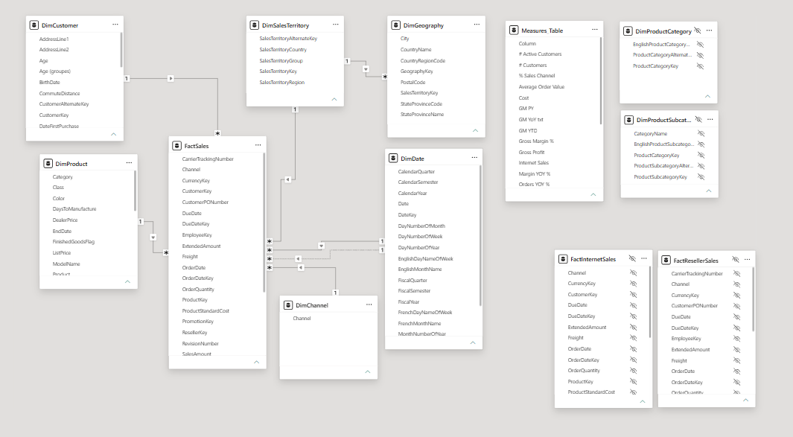

# 📊 Sales Dashboard — Power BI Business Intelligence Project

> An end-to-end sales analytics solution built in Power BI, modelling internet and reseller sales across products, customers, and geographies on a clean star-schema data model.

<!-- Badges — swap the shield links / add your own -->


---

## 🧭 Table of Contents

- [Overview](#-overview)
- [Business Problem](#-business-problem)
- [Dashboard Preview](#-dashboard-preview)
- [Key Features](#-key-features)
- [Data Model](#-data-model)
- [Measures & DAX](#-measures--dax)
- [Tech Stack](#-tech-stack)
- [Repository Structure](#-repository-structure)
- [How to Open the Project](#-how-to-open-the-project)
- [Skills Demonstrated](#-skills-demonstrated)
- [Author](#-author)

---

## 📌 Overview

This project is an interactive **Sales Dashboard** developed in **Microsoft Power BI**, designed to give sales leaders and analysts a single, self-service view of company performance. It consolidates **internet (direct-to-consumer)** and **reseller (B2B)** sales channels into one unified reporting model and lets users slice results by product hierarchy, customer, sales territory, and time.

> 🗂️ *Data source: an AdventureWorks sales data warehouse — a well-known Microsoft sample schema widely used to demonstrate enterprise BI patterns.*

---

## 🎯 Business Problem

Sales data was fragmented across channels, making it hard to answer questions like:

- How are we performing across **internet vs. reseller** channels?
- Which **product categories and subcategories** drive the most revenue and profit?
- Who are our **top customers and territories**, and how are they trending over time?
- What does **year-over-year growth** look like across regions?

This dashboard answers those questions in one place, replacing static spreadsheets with an interactive, drill-enabled report.

---

## 🖼️ Dashboard Preview

| Executive Overview |
|:---:|
|  |

| Sales Analysis |
|:---:|
|  |

| Customer Details |
|:---:|
|  |
<!-- Tip: a short GIF walkthrough at the top of a README dramatically boosts engagement on a portfolio repo. -->

---

## ✨ Key Features

- **Multi-page interactive report** covering executive KPIs, product performance, and customer/geographic breakdowns.
- **Dual-channel analysis** — internet and reseller sales unified in a single model.
- **Star-schema data model** with conformed dimensions shared across fact tables.
- **Dedicated measures table** keeping all DAX calculations organized and discoverable.
- **Time intelligence** — analysis by date hierarchy (year / quarter / month) via a proper date dimension.
- **Product hierarchy drill-down** — Category → Subcategory → Product.
- **Geographic segmentation** — by sales territory and geography.
- **Custom report theme** for consistent, branded visual styling.

---

## 🧱 Data Model

The model follows a classic **star schema**, with fact tables surrounded by conformed dimension tables. This structure keeps relationships simple, queries fast, and the model easy to extend.

### Fact Tables
| Table | Description |
|---|---|
| `FactInternetSales` | Direct-to-consumer (online) sales transactions |
| `FactResellerSales` | Business-to-business (reseller) sales transactions |
| `FactSales` | Consolidated / combined sales fact |

### Dimension Tables
| Table | Description |
|---|---|
| `DimDate` | Central date dimension for time intelligence |
| `DimProduct` | Product master data |
| `DimProductSubcategory` | Product subcategory level of the hierarchy |
| `DimProductCategory` | Top level of the product hierarchy |
| `DimCustomer` | Customer master data |
| `DimGeography` | Geographic attributes (city, region, country) |
| `DimSalesTerritory` | Sales territory groupings |
| `DimChannel` | Sales channel classification |

### Supporting
| Object | Description |
|---|---|
| `Measures_Table` | Dedicated table holding all DAX measures |

> 🔧 *Auto date/time tables generated by Power BI are also present in the model.*

```
                ┌───────────────┐
                │    DimDate    │
                └──────┬────────┘
                       │
  ┌──────────────┐     │     ┌────────────────────┐
  │ DimProduct   ├─────┼─────┤ FactInternetSales  │
  └──────┬───────┘     │     └────────────────────┘
         │             │
  ┌──────┴───────┐     │     ┌────────────────────┐
  │DimProductSub │     ├─────┤ FactResellerSales  │
  └──────┬───────┘     │     └────────────────────┘
         │             │
  ┌──────┴───────┐     │     ┌────────────────────┐
  │DimProductCat │     └─────┤     FactSales      │
  └──────────────┘           └────────────────────┘

   DimCustomer · DimGeography · DimSalesTerritory · DimChannel
              (conformed dimensions)
```



---

## 🧮 Measures & DAX

All calculations are centralized in `Measures_Table` for maintainability. Representative measures in a model of this type include:

```DAX
Total Sales = SUM ( FactSales[SalesAmount] )

Total Profit =
SUMX (
    FactSales,
    FactSales[SalesAmount] - FactSales[TotalProductCost]
)

Sales YoY % =
VAR CurrentSales = [Total Sales]
VAR PriorYear =
    CALCULATE ( [Total Sales], SAMEPERIODLASTYEAR ( DimDate[Date] ) )
RETURN
    DIVIDE ( CurrentSales - PriorYear, PriorYear )
```


## 🛠️ Tech Stack

- **Microsoft Power BI Desktop** — report authoring & data modeling
- **DAX** — measures, calculated columns, and time intelligence
- **Power Query (M)** — data ingestion & transformation
- **TMDL (Tabular Model Definition Language)** — source-controllable model definition
- **PBIP** — Power BI Project format for Git-based version control
- **Star-schema dimensional modeling**

---

## 📁 Repository Structure

```
Sales Dashboard Project.pbip                 # Project entry point
│
├── Sales Dashboard Project.SemanticModel/   # Data model (TMDL)
│   └── definition/
│       ├── model.tmdl
│       ├── relationships.tmdl
│       ├── tables/                          # Fact & dimension tables
│          ├── FactInternetSales.tmdl
│          ├── FactResellerSales.tmdl
│          ├── FactSales.tmdl
│          ├── DimDate.tmdl
│          ├── DimProduct.tmdl
│          ├── ...
│          └── Measures_Table.tmdl

│
└── Sales Dashboard Project.Report/          # Report layer
    └── definition/
        ├── report.json
        └── pages/                           # Report pages & visuals
```

---


## 🧠 Skills Demonstrated

- **Data Modeling** — designing a scalable star schema with conformed dimensions
- **DAX** — building reusable measures and time-intelligence calculations
- **Power Query / ETL** — shaping and cleaning source data
- **Data Visualization** — designing clear, interactive multi-page reports
- **BI Best Practices** — dedicated measures table, custom theming, version control via PBIP/TMDL


⭐ *If you found this project useful or interesting, consider giving the repo a star!*
